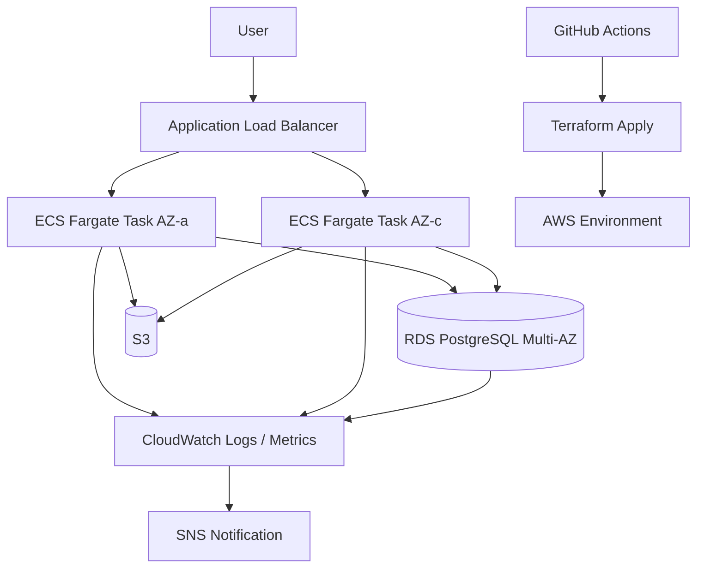

# AWS Cloud Platform Portfolio

## 概要

本リポジトリは、**Terraform による高可用な AWS 基盤の設計・構築**、**GitHub Actions によるフル自動化 CI/CD**、**CloudWatch を用いた監視・通知設計**を通じて、
インフラエンジニアからクラウドエンジニアへキャリアアップするためのポートフォリオとして作成したものです。

単なる「AWS を触りました」という学習記録ではなく、**実務を意識した設計思想・運用設計・自動化方針**まで含めて再現している点を重視しています。

---

## このポートフォリオで証明したいこと

- AWS 上で、可用性・セキュリティ・運用性を意識した基盤を設計できる
- Terraform により、環境差分を考慮した再現性の高い IaC を実装できる
- GitHub Actions を用いて、品質担保からデプロイまで自動化できる
- CloudWatch / SNS による監視・通知設計を IaC として管理できる
- 構築だけでなく、**運用設計・障害対応・監視設計**まで含めて説明できる

---

## 想定システム

小規模〜中規模の Web アプリケーションを AWS 上で安定運用することを想定した構成です。

- **ECS Fargate**: アプリケーション実行基盤
- **ALB**: 外部公開と負荷分散
- **RDS for PostgreSQL**: マネージド DB
- **S3**: ログ保管・アーティファクト保管
- **CloudWatch**: 監視、ログ、アラーム
- **SNS**: 障害通知
- **IAM**: 最小権限のアクセス制御
- **VPC**: Public / Private 分離構成
- **GitHub Actions**: CI/CD 自動化

---

## アーキテクチャ



---

## 技術選定理由

### 1. Terraform
- AWS 環境をコードとして定義し、再現性とレビュー性を高めるため
- 手動構築を排除し、構成差分や設定漏れを防ぐため
- 将来的な環境追加（dev / stg / prod）に対応しやすくするため

### 2. ECS Fargate
- EC2 ベースよりも運用負荷を抑えつつ、コンテナ基盤を利用できるため
- インフラ管理よりも、アプリ実行基盤と運用性に集中できるため
- 小〜中規模の Web サービスを想定した際に、バランスが良いため

### 3. RDS for PostgreSQL
- DB 運用負荷を下げつつ、バックアップ・可用性・保守性を確保できるため
- 業務システムや Web サービスでの利用ケースが広く、ポートフォリオとして実務との接続性が高いため

### 4. CloudWatch + SNS
- メトリクス、ログ、アラーム、通知を AWS 標準サービスで一元化できるため
- 実運用において重要な「異常検知」と「初動」をシンプルに設計しやすいため

### 5. GitHub Actions
- GitHub 上でコード管理から CI/CD まで完結できるため
- Terraform validate / lint / security scan / plan / apply / post-deploy test の流れを一貫して自動化できるため

---

## 設計方針

### 可用性
- VPC は 2AZ 構成
- ECS タスクは複数 AZ に分散
- RDS は Multi-AZ を前提
- ALB 配下で冗長化

### セキュリティ
- IAM は最小権限
- ECS / RDS / ALB の通信は Security Group で明示制御
- 機密情報は GitHub Secrets / AWS Secrets Manager 利用を想定
- S3 はパブリックアクセスブロック有効
- CloudTrail / Config などの拡張も可能な構成を意識

### 運用性
- ログは CloudWatch Logs に集約
- アラームは SNS 経由で通知
- 監視設定も Terraform 管理
- Runbook 化しやすいよう、監視項目と一次対応方針を README / docs に明記

### 拡張性
- Terraform module を分割し、ネットワーク・ECS・RDS・監視を疎結合に管理
- dev / stg / prod の environment 切り替えを想定
- 将来的に WAF, Route53, ACM, OIDC, Blue/Green デプロイにも拡張可能

---

## 想定ディレクトリ構成

```text
.
├── .github/
│   └── workflows/
│       ├── terraform-ci.yml
│       └── deploy.yml
├── docs/
│   ├── architecture.md
│   ├── monitoring.md
│   └── operations.md
├── terraform/
│   ├── environments/
│   │   ├── dev/
│   │   ├── stg/
│   │   └── prod/
│   ├── modules/
│   │   ├── network/
│   │   ├── ecs/
│   │   ├── rds/
│   │   ├── monitoring/
│   │   ├── s3/
│   │   └── iam/
│   ├── main.tf
│   ├── variables.tf
│   ├── outputs.tf
│   └── versions.tf
└── README.md
```

---

## CI/CD パイプライン

### CI
Pull Request 作成時に以下を実施します。

1. `terraform fmt -check`
2. `terraform init`
3. `terraform validate`
4. `tflint`
5. `tfsec`
6. `terraform plan`

### CD
main ブランチへのマージ後、以下を実施します。

1. Terraform Apply
2. ECS サービス更新
3. デプロイ後ヘルスチェック
4. 失敗時はジョブ失敗として検知可能

### この設計にした理由
- 人手を介さず、構成品質とデプロイ品質を一定化するため
- 変更レビュー時に Terraform Plan を可視化し、差分を明確にするため
- 「作れる」だけでなく「安全に変更できる」を示すため

---

## 監視・通知設計

### 監視対象
- ALB TargetResponseTime
- ALB 5XX Error
- ECS CPU / Memory 使用率
- ECS タスク異常終了
- RDS CPU / FreeStorageSpace / DatabaseConnections
- アプリケーションログの ERROR 件数

### 通知先
- SNS Topic
- メール通知（想定）
- 将来的に ChatOps 連携可能な設計

### 監視設計思想
- 通知過多を避けるため、閾値は「即時対応が必要なもの」に絞る
- 単なるメトリクス収集ではなく、**障害の早期発見と一次切り分けに役立つ監視**を重視する
- 「何を見ればよいか分からない監視」ではなく、Runbook に接続できる監視を目指す

---

## 運用設計思想

このポートフォリオでは、構築そのものよりも、**継続運用できる設計であること**を重視しています。

### 1. 手順の標準化
- Terraform による構成管理
- GitHub Actions による自動化
- README / docs による手順明文化

### 2. 障害時の初動を簡単にする
- CloudWatch Alarm から SNS 通知
- 監視項目ごとに「まず何を見るか」を定義
- ログ、メトリクス、リソース状態を追いやすい構成にする

### 3. 人手作業を減らす
- 構築手順をコード化
- 品質チェックを CI に統合
- デプロイ後テストを自動化

### 4. 将来のチーム運用を想定する
- 個人開発前提ではなく、他者レビュー可能なリポジトリ構成
- 変更理由が追いやすい構成
- 保守担当者が入れ替わっても追従しやすい命名と分割を意識

---

## 想定する GitHub Actions ワークフロー

### terraform-ci.yml
- Terraform の整形チェック
- バリデーション
- Lint
- セキュリティスキャン
- Plan 出力

### deploy.yml
- main ブランチマージ時に apply
- ECS 更新
- デプロイ後ヘルスチェック

---


---
